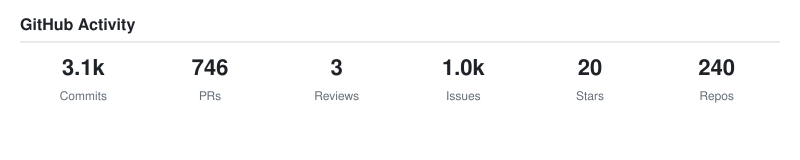
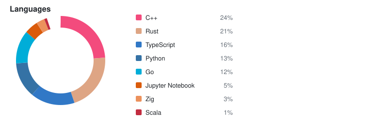
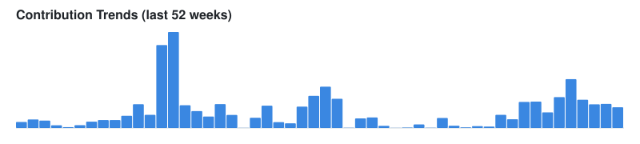
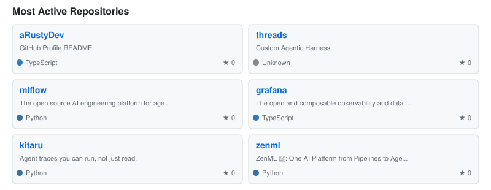
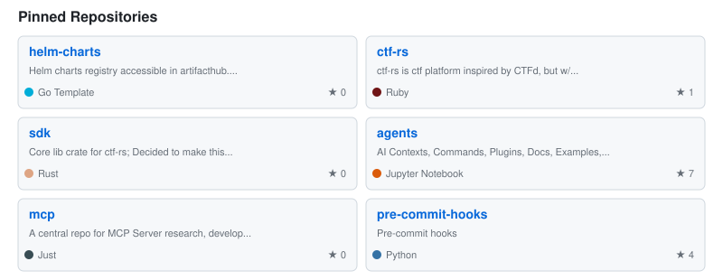

# Hey, I'm Adam 👋

Software engineer building things with Rust, TypeScript, and Go.

## 📊 GitHub Activity

## 🔥 Active Projects

## 🏷️ Recent Releases

| Repo | Version | Date |
|------|---------|------|
| [forge](https://github.com/aRustyDev/forge) | `v1.0.0` | 2026-04-22 |

## 📝 Recent Blog Posts

- [How do I start contributing to the linux kernel?](https://blog.arusty.dev/posts/starting-contributing-to-linux-kernel/) — *2025-05-13*
- [eBPF for Observability: A Practical Introduction](https://blog.arusty.dev/posts/ebpf-observability-intro/) — *2024-07-22*
- [Building a Homelab Kubernetes Cluster](https://blog.arusty.dev/posts/homelab-k8s-setup/) — *2024-04-10*
- [Rust Error Handling: Beyond Result and Option](https://blog.arusty.dev/posts/rust-error-handling-patterns/) — *2024-02-08*
- [Hello World](https://blog.arusty.dev/posts/hello-world/) — *2023-06-15*

## 📌 Pinned

